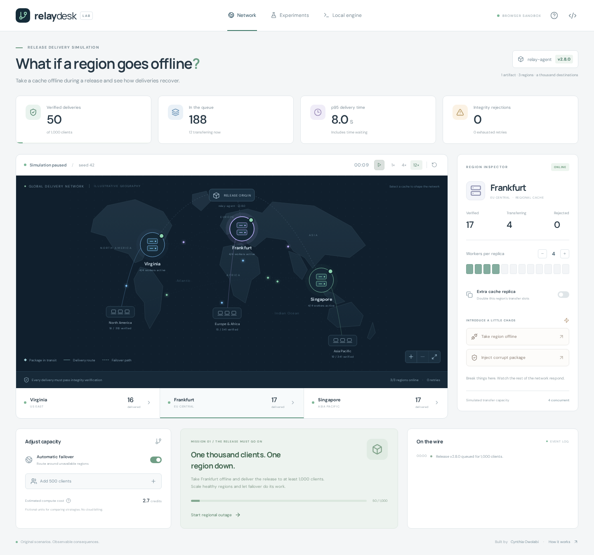

# RelayDesk

**Delivery, under pressure.** A distributed-systems playground by Cynthia Owolabi.

[**Play the interactive demo →**](https://adebolaowolabi32.github.io/relaydesk/) · [Source code](https://github.com/adebolaowolabi32/relaydesk)

Ship a release to 1,000 simulated clients, take a region offline, inject corrupted packages, and keep deliveries moving. A separate local engine runs real HTTP transfers through concurrent Node.js workers and verifies each artifact before publishing it to disk.



Inspired by my work on artifact distribution, cloud migration and distributed applications. All geography, workloads, artifacts and scenarios are original synthetic fixtures; no employer code or private data is included.

## Run the playground

Node.js **22.13+** and npm are required. The local engine uses Node's built-in SQLite module; Node 22 emits an experimental-feature warning for it.

```sh
npm ci
npm run dev
```

Open **http://localhost:5177/relaydesk/**.

The Network and Experiments workspaces require no API key, database service or cloud account. Fonts are bundled locally. Refresh starts a new simulation.

## Try the mission

1. Click **Start regional outage** to take Frankfurt offline.
2. Keep **Automatic failover** enabled and switch to **12×** speed.
3. Select Virginia or Singapore. Add workers or an extra cache replica to improve throughput.
4. Inject a corrupt package in a healthy region. Affected deliveries fail verification and retry.
5. Deliver 1,000 verified packages while Frankfurt remains offline.
6. Open **Experiments** and compare pinned routing with automatic failover under identical demand.

You can pause, reset, add up to 1,000 additional clients, inspect regional delivery counts, and use the map or region cards with a keyboard. The simulation pauses while its tab is hidden or another workspace is selected. Reduced motion starts it paused. Experiments run in a browser worker so the interface remains responsive.

## Run the real local engine

In a second terminal:

```sh
npm run engine
```

Open **Local engine** in the app, then **Connect local engine**. For a failure demonstration, take the EU cache offline and corrupt the US package **before** submitting 24 deliveries. Refresh to watch them finish through the clean AP cache.

The engine listens on **127.0.0.1:3012**; local HTTP cache fixtures listen on **127.0.0.1:3013**. These are three simulated regional endpoints on one machine, not real cloud regions. No external network requests or paid services are needed.

On a remote VM, forward **5177** and **3012** over SSH or your editor's port forwarding and open the localhost URL. Port 3013 is only needed by workers on that VM. The hosted static preview intentionally cannot connect to the local engine.

The engine stores its queue and attempts in `data/local-engine/queue.sqlite`. Verified bytes are stored by SHA-256 digest in `data/local-engine/artifacts/`. Multiple client jobs can reference the same artifact; content storage is shared, while each delivery's actual HTTP request is independently verified.

Repeated submission returns the same jobs. Stop and restart the engine to recover interrupted jobs after their leases expire. For a fresh lab, stop the engine and choose a new data directory:

```sh
RELAY_DATA_DIR=data/another-experiment npm run engine
```

This preserves the earlier experiment. The default demo targets one fixed release and 24 client IDs. The browser simulation and the local engine have independent workloads and state.

## What is real and what is modeled?

| Capability | Browser playground                            | Local engine                                                     |
| ---------- | --------------------------------------------- | ---------------------------------------------------------------- |
| Workload   | 1,000 seeded clients, up to 2,000 with surges | 24 demo client jobs                                              |
| Transfers  | Deterministic model with animated packets     | Actual HTTP bytes in worker threads                              |
| Integrity  | Synthetic corruption and rejection rule       | SHA-256 and byte-length checks in worker and coordinator         |
| Retry      | Four attempts with simulated backoff          | Four attempts, exponential backoff, real timeouts                |
| Recovery   | Change routing, workers and replicas          | Durable SQLite jobs, leases, ownership fencing, restart recovery |
| Delivery   | Model completion                              | Synced, atomically renamed content-addressed artifact            |
| Hosting    | Static build, suitable for Pages              | Local Node.js process and cache fixtures                         |

## Repeatable experiment

```sh
npm run experiment
```

This regenerates [docs/EXPERIMENT.json](docs/EXPERIMENT.json). With seed 42, 1,000 requests, four workers per cache, and Frankfurt offline at second 15, after 240 simulation seconds:

| Strategy             | Delivered | Failed | Still pending | p95 successful delivery |
| -------------------- | --------: | -----: | ------------: | ----------------------: |
| Pinned to home cache |       691 |    309 |             0 |                   99.2s |
| Automatic failover   |       908 |      0 |            92 |                  193.2s |

Failover preserves clients but increases queueing on the surviving capacity. The pinned strategy's lower successful-request latency excludes its 309 failures. These results describe this model, not measured cloud performance.

Cost credits are **fictional comparison units**, calculated from online worker time, cross-region attempts and total attempts. They are not currency, a cloud price estimate, or an invoice.

## Checks

```sh
npm test
npm run build
npx playwright install chromium
npm run test:e2e
npm run format:check
```

The browser suite starts its own temporary engine on ports 3012/3013 and a production preview on 4177. Stop a manually running engine before running it. Simulation and engine tests cover deterministic replay, bounded retries, capacity changes, actual HTTP corruption/outages/timeouts, duplicate submissions, competing coordinators, stale ownership, interrupted workers, and restart recovery. Browser tests exercise controls, a completed outage mission, repeatable comparison, mobile/keyboard/reduced-motion behavior, and the real local lab.

For a production preview:

```sh
npm run build
npm run preview
```

Open http://localhost:4177/relaydesk/. The static base path is `/relaydesk/` in `vite.config.ts`. GitHub CI and a manually triggered Pages workflow are included. The Pages preview runs the browser simulation; the real engine runs locally using the instructions above.

See [architecture](docs/ARCHITECTURE.md) and [local API](docs/API.md).
